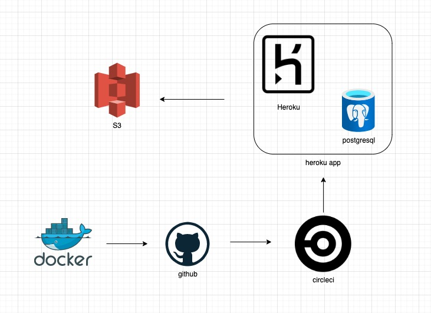

# shopping 
ecommerceのデモサイトです。
ecサイトの機能を楽しむことができます。
https://ecommerce-py-haruki.herokuapp.com/
## paymentのクレジット番号
```
成功　4242 4242 4242 4242
失敗　4000 0025 0000 3155
　　　4000 0000 0000 9995
```
# 使用技術
- Django 4.0.3
- Python 3.10.4
- Heroku/heroku-postgresql
- Docker/docker-compose/nginx,postgresql,gunicorn
- AWS/S3
- Bootstrap/html/css
- stripe
- CircleCi CD
# インフラ構成図

- dockerで開発し、githubでmainブランチにpushしたらcircleciが自動でデプロイしてくれる。
# 機能一覧
- サインアップ、ログイン、ログアウト
- カテゴリー検索、文字検索
- ページネーション
- アドレス登録、自動入力
- 郵便番号から住所自動入力
- 注文、カート

